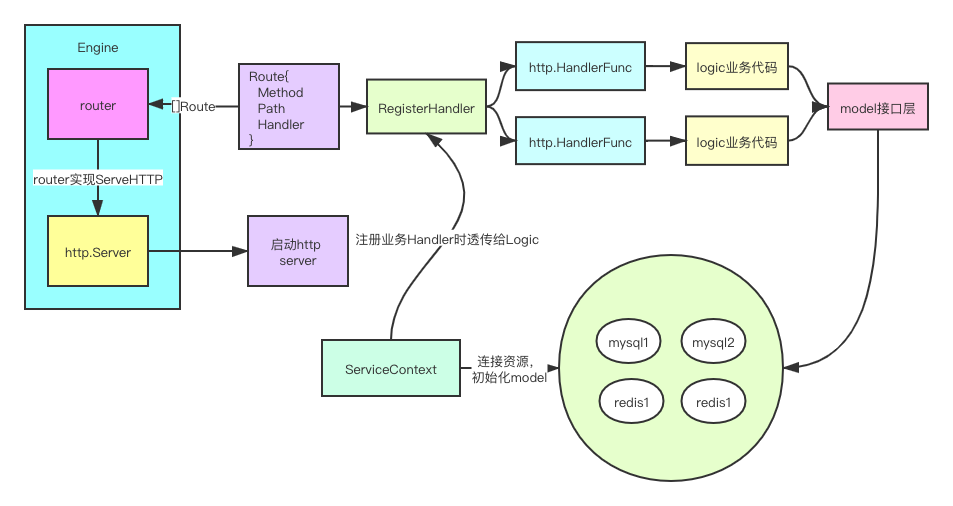

## 目的
> 旨在学习go-zero架构，借鉴了[go-zero](https://github.com/tal-tech/go-zero)代码的架构设计思想


## 设计图

 

### Engine服务引擎
- 负责启动server;  
- 负责组织所有route;  

### router
- 组织所有的api&handler
```cassandraql
包含结构：map[string]map[string]http.HandlerFunc
第一个key是method，第二个key是path, val是handler;
```

### handler包
- 每个handler对应一个api的处理句柄，为http.HandlerFunc类型
### 解析配置文件流程  
> 使用go-zero conf包
```cassandraql
https://github.com/tal-tech/go-zero/tree/master/core/conf
```


